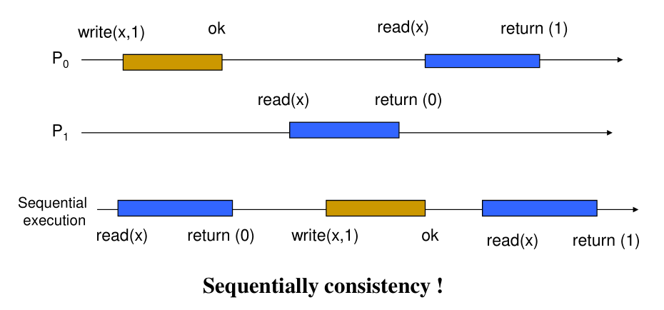
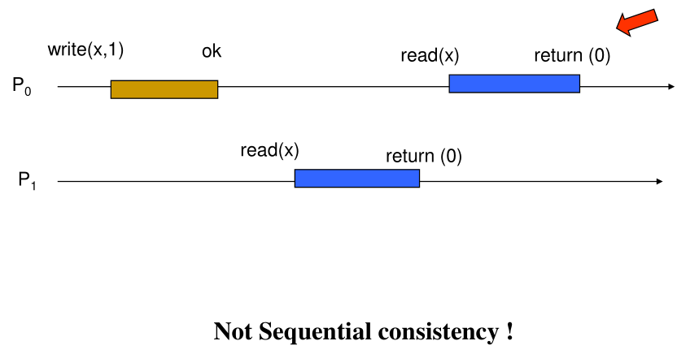
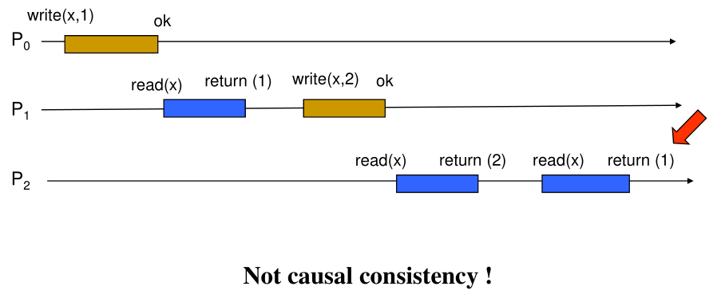
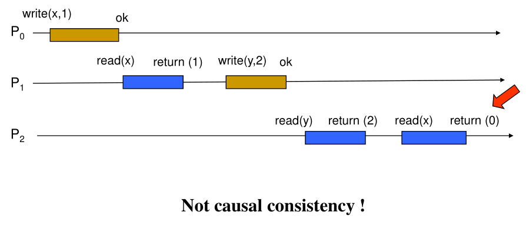
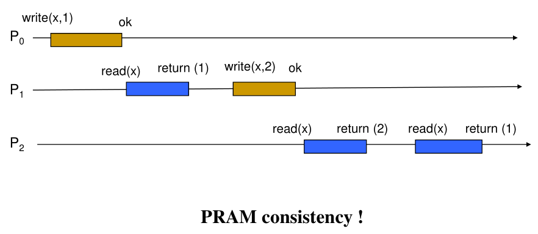

# Shared memory and consistency models

## Mutual exclusion

### Peterson algorithm

Originally syncs two threads, has been expanded to an arbitrary number of processes. However the size of the array is exponential to the number of processes.  
Informally, consider the case where T1 enters the critical section. Then the loop condition must have been false, which means either flag2 was false or victim was set to 2. If flag2 was false, then T2 was not even trying to enter the critical section. If victim was set to 2, then T2 was trying to enter the critical section, but T1 won the race.

#### Code

```c
//T1                           T2
flag1 = true                 flag2 = true
victim = 1                   victim = 2
while (flag2 &&              while (flag1 &&
	victim == 1) {              victim == 2) {
	sleep();}			sleep();}
// critical section          // critical section
flag1 = false                flag2 = false
```
Each thread begins by setting its flag to `true`. It then sets the `victim` variable to its thread id, and waits until either the other thread's flag is `false` or `victim` is set by the other thread.

#### ELI5

Be a gentleman, let people go through the door before going yourself.

### Lamport Bakery Algorithm

N-processes. Uses two shared variables, _flag[2]_ and _turn_. Starvation-free.
- _flag_ at 1 indicates that the process wants to enter the CS
- _turn_ holds the id of the process whose turn it is

#### Code

```c
// Init
choosing[1..n] = 0;
timestamp[1..n] = 0;

// Shared variables
bool boosing[n];
int timestamp[n];

// Entry CS Code
choosing[i] = 1;
timestamp[i] = 1 + max(timestamp);
choosing[i] = 0;
for (j = 1 to n) {
    await(choosing[j]=0);
    await(timestamp[j] == 0) or (timestamp[i] < timestamp[j]);

// Exit CS Code
timestamp[i]=0
}
```

## Linearizibility

For any concurrent execution, there is a total order of the operations such that each read to a location (_variable_) returns the value written by the last write to this location (_variable_) that precedes in the ordered. Total order.

Other more relaxed models exist
- sequential
- causal
- PRAM
- weak, etc...

### Specs

- The total order must be consistent with the temporal order of operations
- Each operation _op(Read or Write)_ has an _invocation_ and _response_ events

An execution in global time is viewed as sequence _seq_ of such invocations and responses

## Sequential

- The result of any execution is the same as if all operations of the processors were executed in some sequential order
- The operation of each individual processor appear in this sequence in the local program order
- Any interleaving of the operations from the different processes is possible. But all processors must see the same interleaving.
- Even if two operations from different processes (on the same or different variables) do not overlap in a global time scale, they may appear in reverse order in the common sequential order seen by all





## Causal

Causal relation is:
- Local order of events of a process define local causal order
- 
- A `write` operation causally precedes a `read` operation of another process if the `read` returns the value written by the `write` operation
- The transitive operation of the baove two relations defines the global causal order

And then:

- Only `writes` that are `causally related` must be seen by all processes in the same order. Concurrent writes must be seen in a different order.





## PRam

`Writes` done by a single processor are received by all other processes in the order in which they were issued but `writes` from different processes may be seen in a different order by different processes

- Only the local causality relation needs to be seen by other processes
- Writes from the same process must be seen b the others in order they were issued




## Registers

Abstraction of distributed shared memory by Lamport

### Safe register

- _Read_ does not overlap with a _write_
_Read_ returns the most recently written value
- _Read_ overlaps with a _write_
_Read_ returns any value that the register could possibly have

### Regular register

It is a _safe_ register and:
- if _Read_ overlaps with a _write_ then _read_ returns either the most recent value of a concurrently written value

### Atomic register

is _regular_ and
- _read_ and _write_ that overlap are _linearizable_. There exists an equivalent totally ordered sequentilal execution of them

# TD

## 1.1 Est-ce que la variable timestamp est bornée? Justifiez

Non borne. Si les processus reviennent on est pas oblige de retourner a 0

## 1.X Deux processus I et j peuvent avoir le timestamp: timestamp[i]=timestamp[j]. En se basant sur le code de la fonction max ci dessus expliquez comment cette égalité peut arriver. Est-t-elle un problème? Justifier.

C'est pas atomique, on peut se retrouver dans la même instruction.
Entre SC n'est pas protégée contre plusieurs accès concurrents alors entre 2 instructions on se retrouve avec 2 processus -> même timestamp à la fin / non c'est pas un problème car L6 comparaison entre les indices

## 1.2 En donnant un scenario d'exécution, expliquez pourquoi l'implémentation ci-dessus de la fonction max toute seule n'assure pas la sureté de l'algorithme de la boulangerie?

```
P1 P2 P3
	- Timestamp[2] = timestamp[3]=1
	- P2 et SC (phase 3)
	- P3 attend entre SC (Phase 2)
	- P1 exécute la Phase 1 jusque la ligne 4 de fonction max k=2
	- P2 sort SC -> timestamp[2] = 0 (phrase 4)
	- P3 rentre en SC
	- P1 finit phase 1 / ligne 5 / timestamp[1]=1
	- P1 phase 2 (compare timestamp[1] et timestamp[3] =? Entre en SC
```
Deux processus peuvent avoir la même valeur du timestamp.

## 1.3 Corrigez l'algorithme

```
max () {
    int MAX=0;
    int TEMP=0;
    for j=1 to N {
        TEMP=timestamp[j];
        if (MAX < TEMP)
            MAX=TEMP;
        }
    timestamp[i] = 1+MAX;
}
```

## 1.4 Est-ce que les phrases sont-elles vraies? Justifiez votre réponse.

1 Vraie
2 Non, ts[i]=ts[k] avec i<k

## 1.5 Pourquoi l'algorithme de la boulangerie a-t-il besoin du tableau choosing? Quel problème entrainerait l'élimination de la ligne 5 (boucle d'attente sur la variable choosing de l'algorithme)?

Pour des raisons de sureté attendre le choix du TS après le comp. C'est une sorte de section critique, barrière en C, bla.  
i exécute Ph1 sort avec ts=1  
K vient de rentrer en ph1, donc ts[k]=0  
i va en ph2 et ph3 donc en SC  
K reprend la main - son ts[k] avec le max =1, il arrive en ph2, ts[k]=ts[i], et k<i donc aussi SC.

## 1.6 Donnez le code d'un tel algorithme

(1.7/2017, I guess)
```
Read-modify-write
        register int ticket = 0;
        register int valid = 0;
        int ticket_i
inc(register r) {
        r +=1
}

Enter SC:
        ticket i = read-modify-write(ticket, int);
        while (ticket_i != valid);
Exit SC:
        read-modify-write(valid, int)
```

## 1.7

```
read_modify_write
	register int ticket = 0;
	register int valid = 0;
	inc (register r) {
		r = (r+1)%n
	}
	int ticket i;

	EntrySC:
		ticket i = read_modify_write(ticket, inc);
		while(ticket i != valid);

	ExitSC:
		read_modify_write(valid, inc);
```

## 1.8

```
	register int ticket = 0;
	atomic bit valid[N] (valid[0] = 1; valid[2..N-1] = 0);

	EntrySC:
		ticket_i = read_modify_write(ticket_i, inc);
		while (valid[ticket_i] != 1);
	ExitSC:
		valid[ticket_i] = 0;
		valid[(ticket_i+1)%N] = 1;
```

## Exercice 1.9

```
On a ticket = 0 et valid = [1 0 0 0]

Proc_i: EntrySC
	ticket_i = 0
	ticket_j = 1
	ticket = 2
	valid = [1 0 0 0]

Proc_i: ExitSC
	ticket = 2
	valid = [0 1 0 0]

Proc_j: EntrySC
Proc_j: ExitSC
	ticket = 2
	valid = [0 0 1 0]
```

## Exercice 2

  |Step| Safe|Regular|Regular|
  |---|---|---|---|
  |P0write|(R',0)|(R',1)|(R',0)|
  |R|0|0|0|
  |P1read|R'{0,1}|R{0,1}|R{0}|

```
  boo WRSW safe register R'= 0;
  boo previous = 0;
    write (R,val) {/* P0 */
      if(previous != val){
        R'=val;
        previous = val;
      }
      return OK;
    }
```

```bash
bool Read(R){
    val = R';
    return(val);
}
```

### 2.1 Quel modele de coherence?

// TODO: Add image
Pas de overlap entre `p2.write(x,3)` et `p3.read(x)`

- pas strict  
// TODO: Why?
- sequentiel oui, c'est possible de trouver une sequence qui est valable  
Sequence possible: `p2.write(x, 1), p1.read(x)=1, p1.write(y,2), p3.write(y,4), p2.read(x)=1, p1.read(y)=4, p2.write(x, 3)`

### 2.2 Writes causally related

`write(x, 1) -> write(x, 3)`  
`write(x, 1) -> write(y, 2)`  
`write(x, 3) -> write(y, 4)`  
Par transitivite:  
`write(x, 1) -> write(y, 4)`

### 2.3 Sequential? Causal? PRAM?

Causal : les operations d'ecriture liees causalement sont vues dans le meme ordre par tous les processus  
Causal implique PRAM

Pas de coherence sequentielle, contre-exemple:  
`p2: w(y, 2), r(y)=4`  
`p3: w(y, 4), r(y)=2`

### 2.4 Sequential au lieu de linearizability

Voir schema Linearizibility slide 14 - modele sequentiel  
Pas strict, car pas de overlap entre `p1.write(x, 1)` et `p2.read(x)=0`

```
int x;
upon operation(op, val)
if(op==write) 
	total_order_broadcast(op, id_i);
else 
	return x;

upon deliver of messages<write, val, id> 
x = val;
if (id = id_i)
	return ok; 
```

// TODO Elle a reecrit la meme chose que sur le poly? 
