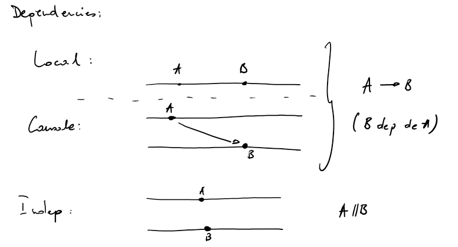
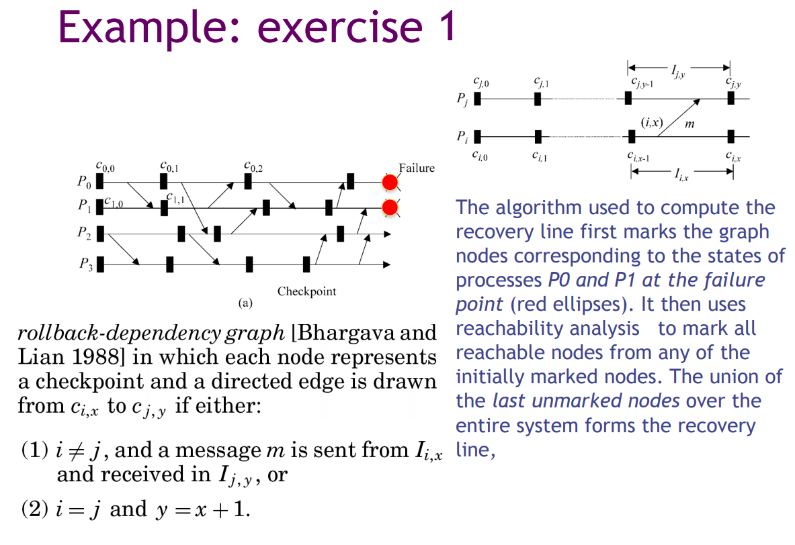
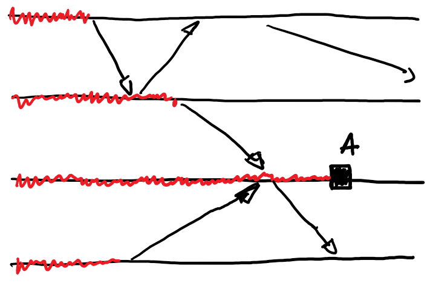
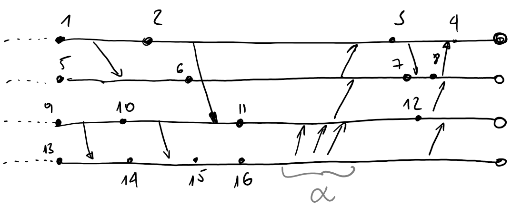
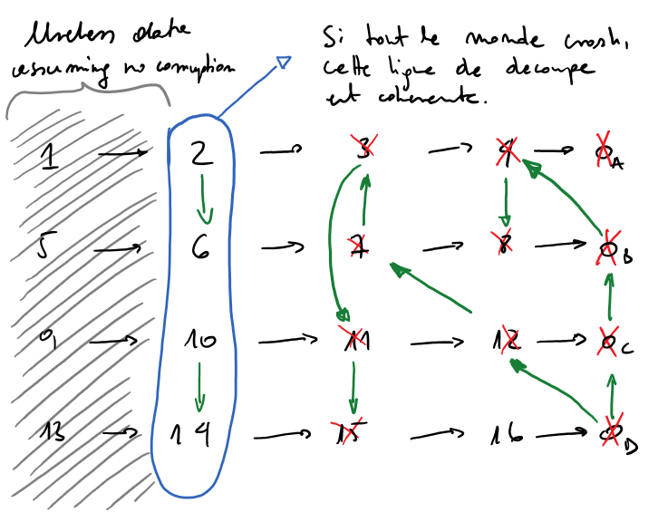

# Types de fautes

```none
  ^ Cardinalite
  |
  .---> Type
 /
/  Temporalite
V
```

3 axes:

- `x` : Type
    - Crash : Just dies, kktybb
    - Temporelle : Je fais ce qui est demande mais trop vite ou trop lentment
    - Byzantine : Hors spec, je fais pas ce que je suis cense faire (mon programme est buge)
    - Malicieux : N'importe quoi expres. Les attaques
- `y` : Temporalite
    - Permenent
    - Periodique
    - Temporaire
- `z` : Cardinalite
    - 1
    - `k<n`
    - Tous

# Checkpointing

3 types de checkpoint: 
- non coordonees 
- coordones (les sites communiquent)
    - implicite
    - explicite je dis fait un checkpoint
        - bloquant j'arrete tout le monde tout le monde fait un checkpoint
        - non bloquant 

On considere que l'algo n'est pas tolerant, les sites finissent par revenir. Mais une fois revenu, il faut reprendre le bon fonctionement du systeme.



Si l'algo est deterministe, et je log tout, tout le temps, sur hard.


Coupure choerente : ce qui est plus vieux qu la coupure ne depent pas de ce qui est plus recent que la coupure. 
Tout les elements du passe soient independents

Tout les evenement plus vieux que la coupure soient independent d'element qui soit plus recent que la coupure. (Arc arriere, quand un message vient du futur pour revenir dans le passe)

Algos:

- Coordonees
    - Les sites se mettent d'accord pour faire des checkpoints de facon "synchrone". Decident ensemble le moment de checkpoint
    - implicites: On tag des messages et en fonction du tag on peut generer une souvegarde de l'etat
    - explicite: les sites deroulent un protocol "let's checkpoint now"
- Spontanes
    - Je fais ce que je veux et je vous emmerde

```none
Spontanes -> Implicites Coordones -> Explicites Coordones
----------------------------------------------------------------->
                Cout d'overhead
```

## Algo1

Reculez  
Colorez  
Reculez  
Colorez  
Rince and repeat

## Algo du rollback-dependency



# Graph

## Dependencies

```none

                .A              .B              
local :     ----------------------------------- 

                  A v
causale :   -----------------------------------
                    \
            -----------------------------------
                      ^ B
```

On dit ***A->B (B depend de A)***

## History

On dit `Hist(A) = {C, C->A}`



## Rollback graph

```none
       C v           A v
-----------------------------------
         \
-----------------------------------
          ^D         ^ B

donne

C -> A
    |
    v
D -> B
```

Logique: Si je retire X alors je peux apres utiliser l'autre

## Execution timeline



## The graph

To get the graph we take the next checkpoint on both the sender and receiver lines and retrace an arrow between the two, following the sens from the original exeuction MPI.


### Scenario 1 : All crash



### Scenario 2 : Crashes one by one

We use this scenario to find useless checkpoints


### Scenario 3 : Z-Chemins/Cycles

On part toujours a droite d'un point, on arrive toujours a gauche d'un point.

Soit une cupure corehente `C` alors qq soit `i`, `j`, il n'existe pas de z-chemin qui va de `i` a `j`. 

If there's a Z-Cycle on a checkpoint, then that checkpoint is useless. `A-z-B`


// TODO Why?
