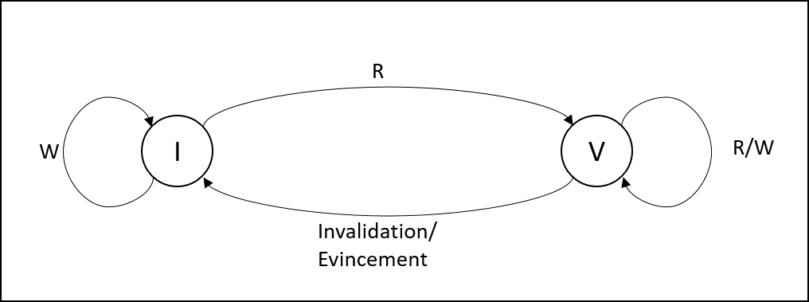
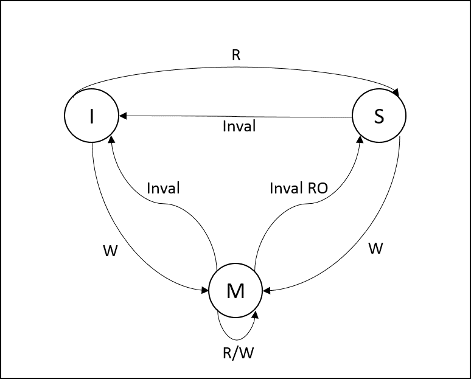
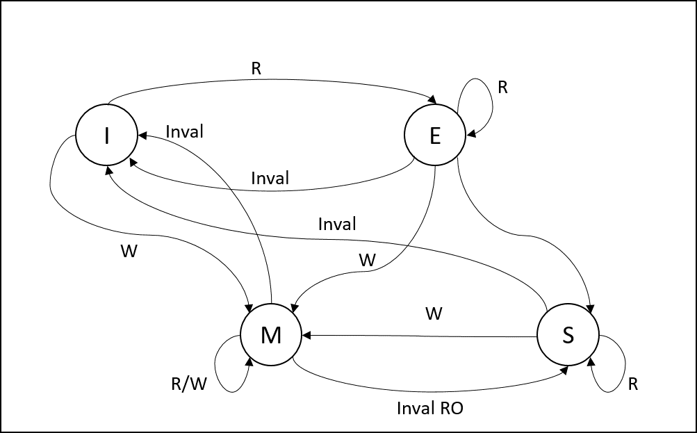

# Coherence de cache

## 1. Introduction

Après les protocoles Write-Through et Write-Back

* Que se passe-t-il en milieu multicoeur?
* Notion de **cohérence de cache**: garantir que toutes les copies (valides) d'une ligne de la mémoire ont la même valeur à un instant donné.
* On parle de vue cohérente de la mémoire entre les differents caches/coeurs.


## 2. Types et dégrés de liberté des protocles de cohérence

1. Write-Through ou Write-Back
2. Allocation sur écriture ou non (suite a un miss write).
Ces deux points ne sont pas propres a la cohérence.

3. Espionnage (snoop) ou répertoire (directory)
  * **Espionnage**: les caches (L1) "voient" passer les requêtes et se mettent a jour tout seuls (Utilisé en général sur le bus)
  * Avec **répertoire**, un ou plusieurs composants matériels centralisent les informations relatives au copies. (nombres et numéro du cache L1 qui ont une copie + état de la ligne)
  * Utilisé en général sur un NoC (Network On Chip) ou un crossbar
  * Pas nécessairement le cas (ex: scorpio)

4. **Invalidation ou mise à jour**: lorsque le controleur du L2 reçoit une écriture sur une ligne qui contient des copies, doit-il envisager des mises à jour avec la nouvelle valeur ou simplement invalider ces copies?
  * Avantage des mises a jour: évite des futurs miss potentiels
  * Avantage des invalidations: évite de générer plein de requêtes de mise a jour (update) vers des copies qui ne sont pas utilisées

En pratique, toutes les combinaisons ne pas possibles/pertinentes.

Exemple:
* WTI (Write-Through Invalidate), write non allocate (snoop, dir)
* WTI, write allocate (snoop, dir)
* WTU (Write-Through Update), write non allocate (snoop, dir)
* WB MSI allocate (snoop, dir)
* WB MESI allocate (snoop, dir)
* WB MOESI allocate (directory)

Note: les protocoles peuvent être plus compliqués que ça, par exemple hierarchiques, hybrides,..

Dans la suite on ne s'interessera qu'aux protocoles à base de directory

### Résumé des caractéristiques des protocoles WT et WB.

#### *Write-Through*
* Peu complexe, peu de mémoire nécessaire
* idée: propager toutes les écritures vers le L2 (pareil monocoeur)
* Traffic élevé, pas acceptable sur certains réseaux d'interconnection

#### *Write-Back*
* Plus complexe
* Plus de bits de méta-données par ligne
* Moins de traffic, donc moins de consommation


### Schémas des états d'une ligne de cache L1

#### WTI Non Allocate


#### WB MSI (Allocate)


#### WB MESI


### 3. Specification des protocoles

#### 3.1. Définitions

* **Requête directe** : requête dont le but est de fournir à un cache L1 une copie et/ou des droits d'écriture

* **Requête de cohérence** :  une requête dont le but est de garantir la cohérence entre les caches L1 et le L2: une telle requête a pour initiateur le cache L2 et pour destination un(des) cache(s) L1

+ A chaque requête est envoyée une réponse

#### 3.1.2. Spécification de haut-niveau d'un protocole WTI

**Cache L1**
```
	Si réception d'une requête d'invalidation:
		Invalider la ligne (si présente)
		Répondre à la requète d'invalidation
	Sinon si reception d'une requête du processeur:
		Si Read:
			Si Hit:
				Repondre au processeur
			Si Miss:
				Envoyer une requiète de type miss vers le L2
				Attendre la réponse puis séléctionner une ligne victime et la remplacer
			          avec la ligne reçue
				Répondre au processeur (ou retour en IDLE)
		Si Write:
			Si Hit:
				Mettre a jour le cache
			Envoyer l'écriture vers la mémoire (la mettre dans le write-buffer)
			Répondre au processeur
```

**Cache L2**
```
	Recevoir une requête d'un cache L1
		Si Read:
			Ajouter le cache L1 à la liste des caches ayant une copie
			Envoyer une réponse avec la ligne
		Si Write:
			Pour chaque L1 ayant une copie: Invalidation (requête)
			Attendre que toutes les réponses soient obtenues
			Mettre a jour la ligne
			Répondre au cache L1
```
#### **Update (WTU)**

**Cache L1**
```
	Si réception d'une requête d'update:
		Mettre a jour la ligne
		Répondre à la requète d'invalidation
	Sinon si reception d'une requête du processeur:
		Si Read:
			Si Hit:
				Repondre au processeur
			Si Miss:
				Envoyer une requiète de type miss vers le L2
				Attendre la réponse puis séléctionner une ligne victime et la remplacer
        avec la ligne reçue
				Répondre au processeur (ou retour en IDLE)
		Si Write:
			Si Hit:
				Mettre a jour le cache
			Envoyer l'écriture vers la mémoire (la mettre dans le write-buffer)
			Répondre au processeur
```

**Cache L2**
```
	Recevoir une requête d'un cache L1
		Si Read
			Ajouter le cache L1 à la liste des caches ayant une copie
			Envoyer une réponse avec la ligne
		Si Write
			Pour chaque L1 ayant une copie (sauf l'emetteur): update (requête)
			Attendre que toutes les réponses soient obtenues
			Mettre a jour la ligne
			Répondre au cache L1
```

#### 3.1.3. Spécification de haut niveau d'un protocole WB-MESI

Une ligne de cache L1 peut être dans 4 états:
* **M:** Modified (droit de R/W et ligne dirty)
* **E:** Exclusive (droit de R/W et ligne clean)
* **S:** Shared droit de lecture
* **I:** Invalidations

Au niveau du L2, liste des copies pour chaque ligne + état S ou E/M (ou I)

**Types de requête**
* MISS: miss de lecture (RSP.MISS, RSP.MISS.EXCLU)
* GETM: requête pour droit d'écriture quand la ligne est déjà présente dans le L1 (Dans l'état S) (RSP.GETM)
* GETM_LINE: droit écriture et copie de la ligne (RSP_GETM_LINE)
* WRITE_BACK: recopie d'une ligne dirty en mémoire (RSP_WRITE_BACK)

**Requêtes pour la cohérence**
* INVAL: invalidation (RSP_INVAL_CLEAN, RSP_INVAL_DIRTY)
* INVAL_RO: supression du droit d'écriture (RSP_INVAL_RO_CLEAN, RSP_INVAL_RO_DIRTY)


* Quand le L2 reçoit une requête de type MISS:
  * S'il n'y a pas de copies, réponse RSP_MISS_EXCLU et passage a l'état E/M
  * Si la ligne est dans l'état S, ajout du cache L1 a la liste et réponse RSP.MISS
  * Si la ligne est dans l'état E/M, envoi de INVAL_RO puis passage dans l'état S (RSP_MISS)

* Quand le L2 reçoit un GETM(_LINE)
  * Invalidation (INVAL) des copies sauf L1 ayant fait la requête
  * Passage dans l'état M
  * RSP_GETM(_LINE)

* Quand L1 reçoit une requête INVAL (resp. INVAL_RO)
  * Si la ligne n'est pas en cache (ou invalide): RSP_INVAL(_RO)
  * Si la ligne est en cache: chargement dans l'état I (resp. S) puis réponse avec copie de la ligne si la ligne est dirty *Spécif complète TP2*

  * Une suite de requêtes (R/W à des adresses) et plus efficaces pour le protocole (a) le protocole (b) et reciproquement.

N° | a | b
---|---|---
1. | WTI WA | WTI WNA
2. | WTI WNA | WTU WNA
3. | WTU WNA | WB MESI
4. | WB MESI | WB MSI


##### N°1
```
	a > b (Non propre a la cohérence)
		W(X)
		R(X)
			Pas vraiment de cas, sauf si l'allocation est en préchargement (
        pas bloquant)
	b > a
		W(X)
		W(X+LINE_SIZE)
		W(X+2*LINE_SIZE)
```
#### N°2

**a>b**
P0 | P1
--- | ---
R(X) |
|| R(X)
W(X)|
W(X)|
W(X)|
W(X)|

**b>a**
P0 | P1 | commentaire
--- | --- | ---
R(X) |
|| R(X+4)| Mot dans la même ligne de cache que X
|| W(X+4)
R(X)|
W(X)|
||R(X+4)|
||W(X+4)|
R(X)||inval
W(X)|| 1 miss/R & 1 inval/W & 1 update/W

#### N°3

**a>b**
Pour chaque R et pour chaque W, 4x latence L1->L2 ou L2->L1.

**b>a**
P0 | P1
--- | ---
R(X) |
|| R(X+4)
W(X)|
W(X)|
W(X)|
W(X)|

#### N°4

**a>b**
P0|P1
---|---
R(X)|
W(X)|

**b>a**
P0|P1
---|---
R(X)|
||W(X)|


### Exercice 1

**a.**
```assembly
#prologue
addiu $29, $29, -29

#corps
la $4, lock
jal lock_acquire
nop
la $8,curr_elem
lw $9, 0($8)
sll $10,$9,2
la $11,table
addu $11,$11,$10
lw $12,0($11)
sll $12,$12,1
sw $12, 0($11)
addiu $9,$9,1
sw $9,0($8)
la $4, lock_acquire
jal lock_release
nop

#epilogue
$29,$29,4
jr $31
```

**b.**
* WTU identique
* MESI pour le cache L1 :
  * Etat M au lieu de valide pour tab
  * Etat S au lieu de valide pour  curr_elem

| Directory Etat | TAG | Copies
| :------------- | :------------- | :------------- |
|E/M|&tab[0] | 0
| ...| ...|...
| E/M| &tab[2044]|0
|E/M| &tab[2048]|1
|||
|S|curr_elem |0,1


**c.** Pour l'execution complète

* WTI:
  * \#miss = 1(*curr_elem P0*) +2048/4 (*tab p0*) + 1 (*curr_elem p1*) +2048/4 (*tab p1*)
  * \#inval = 1(*ecriture curr_elem*)
  * \#écritures vers L2: 8192 (*2048 tab P0, 2048 tab P1, 2048 curr_elem P0, 2048 curr_elem P1*)


* WTU:
  * \#miss = 1026
  * \#updates = 2048 (*écriture curr_elem dans P1*)
  * \#écritures = 8192


* WB:
  * \#miss = 1 + 2048/4 + 1 + 2048/4
  * \#GETM = 1 (*curr_elem P1*)
  * \#GETM_LINE = 0
  * \#WRITE_BACK = 0
  * \#INVAL = 1 (*ecriture curr_elem P1* CLEAN)
  * \#INVAL_RO = 1 (*ecriture curr_elem p1* DIRTY)
