# Git, wut dat? [nmv-cs1-20-sept-17]

- [Git, wut dat? [nmv-cs1-20-sept-17]](#git-wut-dat-nmv-cs1-20-sept-17)
    - [Definitions](#definitions)
        - [(D)VCS](#dvcs)
            - [Goals](#goals)
        - [`diff` & `patch`](#diff-patch)
            - [```diff``` - compare files line by line](#diff---compare-files-line-by-line)
            - [```patch``` - apply a diff file to an original](#patch---apply-a-diff-file-to-an-original)
                - [Important flags](#important-flags)
            - [Example](#example)
        - [History](#history)
        - [Branch](#branch)
        - [Trunk](#trunk)
        - [Sub-branch](#sub-branch)
        - [Merge](#merge)
    - [Architecture interne git](#architecture-interne-git)
        - [Blobs](#blobs)
        - [Trees](#trees)
        - [Commits](#commits)
            - [CVS](#cvs)
            - [SVN](#svn)
            - [Git](#git)
        - [Tags](#tags)
        - [Overview](#overview)
    - [Git Locally](#git-locally)
        - [Regular repository](#regular-repository)
        - [```git init```](#git-init)
            - [Server repository](#server-repository)
                - [Example](#example)
        - [Commit](#commit)
            - [Useful commands](#useful-commands)
            - [Examples](#examples)
                - [Ex-1](#ex-1)
                - [Ex-2](#ex-2)
        - [Branch](#branch)
            - [Basic commands](#basic-commands)
            - [Branch example](#branch-example)
            - [Commit's internal structure](#commits-internal-structure)
        - [Merge](#merge)
        - [Rebase](#rebase)
        - [Rebase vs Merge](#rebase-vs-merge)
        - [Mistakes](#mistakes)
            - [Amend](#amend)
            - [Revert](#revert)
            - [Reset](#reset)
                - [`--hard`](#hard)
                - [regular (no flags)](#regular-no-flags)
                - [`---soft`](#soft)
    - [Distributed git](#distributed-git)
        - [DVCS : Distributed version control system](#dvcs-distributed-version-control-system)
        - [Remote push](#remote-push)
        - [Workflows](#workflows)
    - [Conclusions](#conclusions)
    - [Extra ressources](#extra-ressources)

## Definitions

### (D)VCS

(Distributed) Version Control System

#### Goals

- Hold all the versions of all the files
- Hold all the dir tree
- Allow identification of dirs and files
- Provide utilities to manage it all
- DVCS, same but over distributed architecture

### `diff` & `patch`

#### ```diff``` - compare files line by line

Important flags:

- ```-w --ignore-white-space``` ignore all white space.
- ```-u  -U NUM  --unified[=NUM]``` Output NUM (default 3) lines of unified context.

#### ```patch``` - apply a diff file to an original

```none
SYNOPSIS
       patch [options] [originalfile [patchfile]]
       but usually just
       patch -p num "patchfile
```

##### Important flags

```none
-pnum  or  --strip=num
Strip the smallest prefix containing num leading slashes from each file name
found in the  patch file. A  sequence of one or more adjacent slashes is
counted as a single slash. This controls how file names found in the patch
file are treated, in case you keep your files in a different directory than
the person who sent out the patch. For example, supposing the file name in the
patch file was

/u/howard/src/blurfl/blurfl.c

setting -p0 gives the entire file name unmodified, -p1 gives

u/howard/src/blurfl/blurfl.c

without the leading slash, -p4 gives

blurfl/blurfl.c

and not specifying -p at all just gives you blurfl.c.  Whatever you end up
with  is  looked  for
either in the current directory, or the directory specified by the -d option.

-r  --recursive
Recursively compare any subdirectories found
```

#### Example

```bash
$ diff toto.c toto-origin.c " correction.patch
$ bzip2 correction.patch
$ bzcat correction.patch.bz2 | patch -p 0 toto.c

# Or recursively
$ cp -r Linux-2.6.17 linux-2.6.17-orig
$ cd Iinux-2.6.17
$ vim
$ cd ..
$ diff -r -u Linux-2.6.17-orig Liinux -2.6.17 " \
    network-driver-b44.patch
$ gzip -9 network-driver-b44.patch
$ cd Iinux—2.6.17
$ zcat network-driver-b44.patch.gz | patch -p 1
```

### History

History is a directed acyclic graph consisting of all possible versions one can compute from adjacent versions by applying patches, which are represented as outgoing arcs.


### Branch

A branch in Git is simply a lightweight movable pointer to one of the commits. The default branch name in Git is master. As you initially make commits, you’re given a master branch that points to the last commit you made. Every time you commit, it moves forward automatically.

A branch is a parallel version of a repository. It is contained within the repository, but does not affect the primary or master branch allowing you to work freely without disrupting the "live" version. When you've made the changes you want to make, you can merge your branch back into the master branch to publish your changes.

Branch of a version v[i] of a history is a sub-graph composed of the set of versions available from v[i] in the history graph.


### Trunk

Trunk or main branch is the branch from the latest stable version.


### Sub-branch

Une sous-branche SB1 d'une branche B2 est le sous graphe composé de l'ensemble des versions d'une branche B1 n'appartenant pas a la branche B2, l'intersection de Bl et de B2 devant étre non vide.

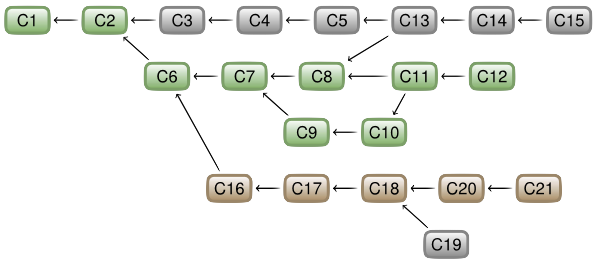

### Merge

On appelle merge toute version ayant un degre sortant strictement superieur a 1. Cette version correspond alors a la fusion des patchs de plusieurs branches.

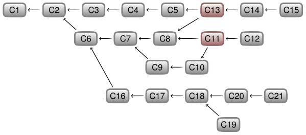

## Architecture interne git

Le nom du fichier est dans le repertoire

Un blob tree est un repertoire
Chaque blob dans git c'est 1 fichier

Les noms de fichier en ```projet.git``` viennent du flag ```--bare``` qui garde l'historique des fichiers, en gros que le dossier .git interne. On garde que ```/.git```

Git uses essentially 4 types of objects:

- Blob: Stores the files contents
- Tree: Contains the directories tree
- Commit: Contains versions of the repository
- Tag: Name for a version, either user-specified or `sha1` generated.

Blob, Tree and Commit are not mutable and shouldn't normally be deleted.

### Blobs

Blobs store file contents.

- They're identified with `sha1` of it's content
- Every new version of a file has a new blob
- Blob doesn't depend on name nor path
  - If a file is renamed, no new blob
  - If a file is moved, no new blob

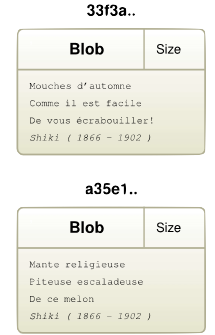

### Trees

Stores the list of files in a dir:

- Tree is a set of pointers to blobs and other trees
- Tree associates filename (dirname) with every blob (tree) pointer
- A set of trees describes the state of a dir hierarchy at a given point

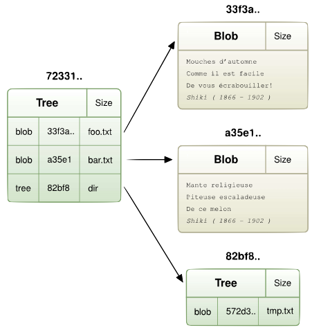

### Commits

To commit a file means to save it's version in a version manager.

#### CVS


CSV uses patch versionning, file by file

- [-] Hard to find a coherent state of the system
- [-] Accessing a version means reapplying all the patches

#### SVN


SVN uses global versionning on all the patches

- [+] Every version number represents a coherent version
- [-] Accessing a version requires re-applying all the patches

#### Git

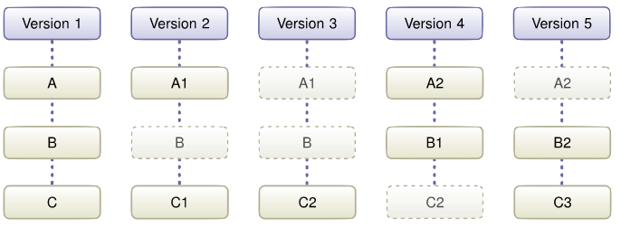
Git uses global versionning for files

- [+] Every version number represents a coherent version
- [+] Direct acces to versions

Commit stores the state of a part of the repository at a given time. It contains:

- Pointer to Tree of which state we want to save
- Pointer to one or more other Commits to build history
- Name of the author, and of the commiter
- Description string

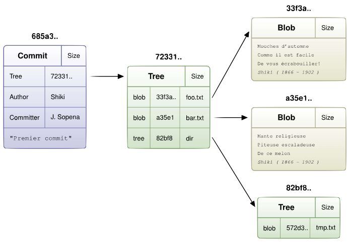

The difference between *commiter- and *author*:

As not everyone is allowed to commit, and common courtesy dictates to name the contributor, two fields are present. Committer is the person with rights that commits to the repository, while the Author is the person that's actually written the code.

### Tags

Allows to identify objects by a name. Contains:

- pointer to _Blob_, _Tree_ or _Commit_
- A signature

### Overview

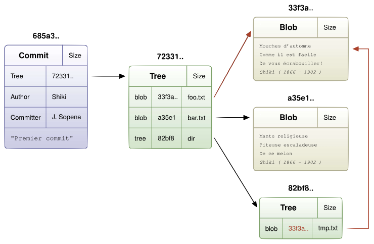

## Git Locally

So what is git? Git is simply a set of commands, a large one to it. In total over 145, one of which is the `git` command, which is the caller for all the others. For example `git add` in reality calls `git-add`. Other example `git-add file.txt = git add file.txt`.

### Regular repository

### ```git init```

Initializes an empty git repository.

```bash
$ mkdir proj
$ cd proj
$ git init
defaulting to local storage area
```

or in case of pre-existing repository:

```bash
$ cd project
$ git init
$ git add .
$ git commit -alias
defaulting to local storage area
```

#### Server repository

Server version of the repository contains

- No files, only history
- No `proj/.git` directory, `proj.git/`
- No `remote` (origin)

##### Example

```bash
$ git clone --bare "URL"
$ cat proj.git/config
[core]
...
bare = true
...
```

### Commit

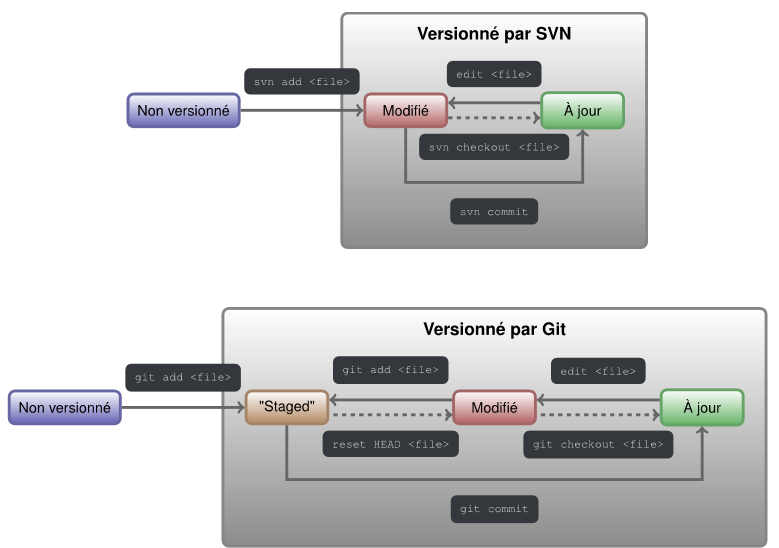

#### Useful commands

- `add` This command updates the index using the current content found in the working tree, to prepare the content staged for the next commit
- `commit` Stores the current contents of the index in a new commit along with a log message from the user describing the changes
- `reset HEAD` removes the reference of a file added with `add`

#### Examples

##### Ex-1

```bash
$ echo "file1" " foo.txt
$ git add foo.txt
$ git commit -m "Commit description"
```

##### Ex-2

```bash
$ mkdir project
$ cd project
$ git init
$ echo "toto" " foo.txt
$ git add foo.txt
$ git commit -m "Add foo.txt"
$ mkdir dir
$ echo "titi" " dit/bar.txt
$ git add dir/bar.txt
$ git commit -m "Add dir/bar.txt"
$ echo "tutu" " dir/bar.txt
$ git add dir/bar.txt
$ git commit -m "Modif dir/bar.txt"
```


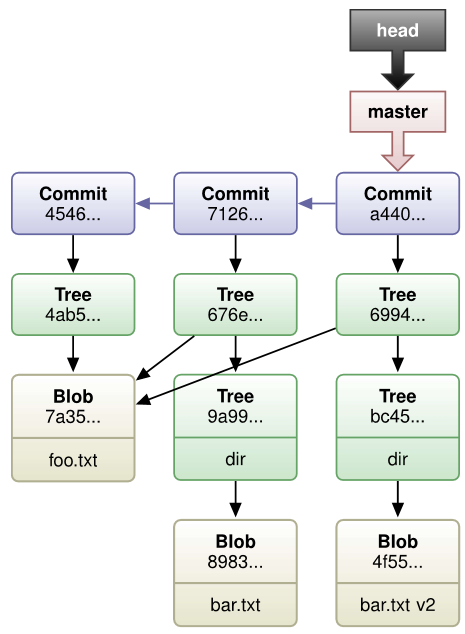

### Branch

#### Basic commands

- `branch` list branches (active one flagged `*`)
- `branch "name"` create new branch
- `branch -m` rename branch
- `branch -d` delete branch
- `checkout` change (and/or create) active branch
- `show-branch` show branches and their commits

#### Branch example

```bash
$ git branch
  - master
$ git branch myBranch
$ git branch
  myBranch
  master
$ git checkout myBranch
$ git branch
  - myBranch
    master
```

#### Commit's internal structure

```bash
$ ls
  foo.txt dir
$ git branch myBranch
$ git checkout myBranch
$ touch file1.txt
$ ls
  dir file1.txt foo.txt
$ git add file1.txt
$ git commit -m "Add file1.txt"
$ git checkout master
$ ls
  dir foo.txt
$ touch file2.txt
$ git add file2.txt
$ git commit -m "Add file2.txt"
```

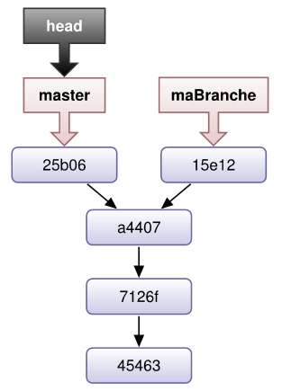

### Merge

`git-merge` - Join two or more development histories together

Incorporates changes from the named commits (since the time their histories diverged from the current branch) into the current branch. This command is used by git pull to incorporate changes from another repository and can be used by hand to merge changes from one branch into another.

Assume the following history exists and the current branch is "master":

             A---B---C topic
            /
       D---E---F---G master

Then "git merge topic" will replay the changes made on the topic branch since it diverged from master (i.e., E) until its current commit (C) on top of master, and record the result in a new commit along with the names of the
two parent commits and a log message from the user describing the changes.

             A---B---C topic
            /         \
       D---E---F---G---H master

The second syntax ("msg" HEAD "commit"...) is supported for historical reasons. Do not use it from the command line or in new scripts. It is the same as git merge -m "msg" "commit"....

The third syntax ("git merge --abort") can only be run after the merge has resulted in conflicts. git merge --abort will abort the merge process and try to reconstruct the pre-merge state. However, if there were uncommitted
changes when the merge started (and especially if those changes were further modified after the merge was started), git merge --abort will in some cases be unable to reconstruct the original (pre-merge) changes. Therefore:

Warning: Running git merge with non-trivial uncommitted changes is discouraged: while possible, it may leave you in a state that is hard to back out of in the case of a conflict.

### Rebase

If "branch" is specified, git rebase will perform an automatic git checkout "branch" before doing anything else. Otherwise it remains on the current branch.

 If "upstream" is not specified, the upstream configured in branch."name".remote and branch."name".merge options will be used; see git-config(1) for details. If you are currently not on any branch or if the current branch does
 not have a configured upstream, the rebase will abort.

 All changes made by commits in the current branch but that are not in "upstream" are saved to a temporary area. This is the same set of commits that would be shown by git log "upstream"..HEAD (or git log HEAD, if --root is
 specified).

 The current branch is reset to "upstream", or "newbase" if the --onto option was supplied. This has the exact same effect as git reset --hard "upstream" (or "newbase"). ORIG_HEAD is set to point at the tip of the branch before
 the reset.

 The commits that were previously saved into the temporary area are then reapplied to the current branch, one by one, in order. Note that any commits in HEAD which introduce the same textual changes as a commit in
 HEAD.."upstream" are omitted (i.e., a patch already accepted upstream with a different commit message or timestamp will be skipped).

 It is possible that a merge failure will prevent this process from being completely automatic. You will have to resolve any such merge failure and run git rebase `--continue`. Another option is to bypass the commit that caused
 the merge failure with `git rebase --skip`. To check out the original "branch" and remove the `.git/rebase-apply` working files, use the command `git rebase --abort` instead.

 Assume the following history exists and the current branch is "topic":

               A---B---C topic
              /
         D---E---F---G master

 From this point, the result of either of the following commands:

```bash
     git rebase master
     git rebase master topic
```

 would be:

                       A'--B'--C' topic
                      /
         D---E---F---G master

 NOTE: The latter form is just a short-hand of git checkout topic followed by git rebase master. When rebase exits topic will remain the checked-out branch.

 If the upstream branch already contains a change you have made (e.g., because you mailed a patch which was applied upstream), then that commit will be skipped. For example, running `git rebase master` on the following history  (in which A’ and A introduce the same set of changes, but have different committer information):

               A---B---C topic
              /
         D---E---A'---F master

 will result in:

                        B'---C' topic
                       /
         D---E---A'---F master

 Here is how you would transplant a topic branch based on one branch to another, to pretend that you forked the topic branch from the latter branch, using rebase `--onto`.

 First let’s assume your topic is based on branch next. For example, a feature developed in topic depends on some functionality which is found in next.

     o---o---o---o---o  master
           \
            o---o---o---o---o  next
                             \
                              o---o---o  topic

We want to make topic forked from branch master; for example, because the functionality on which topic depends was merged into the more stable master branch. We want our tree to look like this:

      o---o---o---o---o  master
          |            \
          |             o'--o'--o'  topic
           \
            o---o---o---o---o  next

We can get this using the following command:

`git rebase --onto master next topic`

Another example of `--onto` option is to rebase part of a branch. If we have the following situation:

                              H---I---J topicB
                             /
                    E---F---G  topicA
                   /
      A---B---C---D  master

then the command

`git rebase --onto master topicA topicB`

would result in:

                   H'--I'--J'  topicB
                  /
                  | E---F---G  topicA
                  |/
      A---B---C---D  master

This is useful when topicB does not depend on topicA.

A range of commits could also be removed with rebase. If we have the following situation:

    E---F---G---H---I---J  topicA

then the command

`git rebase --onto topicA~5 topicA~3 topicA`

would result in the removal of commits F and G:

    E---H'---I'---J'  topicA

This is useful if F and G were flawed in some way, or should not be part of topicA. Note that the argument to --onto and the "upstream" parameter can be any valid commit-ish.

In case of conflict, git rebase will stop at the first problematic commit and leave conflict markers in the tree. You can use git diff to locate the markers ("""""") and make edits to resolve the conflict. For each file you
edit, you need to tell Git that the conflict has been resolved, typically this would be done with

`git add "filename"`

After resolving the conflict manually and updating the index with the desired resolution, you can continue the rebasing process with

`git rebase --continue`

Alternatively, you can undo the git rebase with

`git rebase --abort`

### Rebase vs Merge

```bash
$ git checkout maBranche
$ git merge master
```

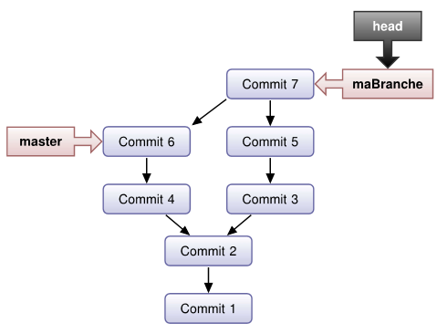

```bash
$ git checkout myBranche
$ git rebase master
```

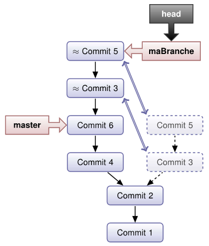

```bash
$ git checkout branche2
$ git rebase -onto master branche1 branche2
```


### Mistakes

**If the mistake is already pushed, the only acceptable model is _revert_. Other solutions may induce incoherence.**

#### Amend

Modify the last commit

```bash
$ ls
  foo.txt dir
$ touch bar.txt
$ git commit -m "Ajou d'un fichier."
$ git add bar.txt
$ git commit --amend -m "Ajout d'un fichier"
```

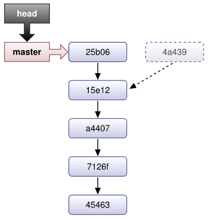

#### Revert

To cancel a commit with a different commit

```bash
$ git branch master
$ cat fichierl.txt
  Premiere version de Fl
$ cat fichier2.txt
  Premiere version de F2
$ echo "Deuxieme version de F1" " fichier1.txt
$ git add fichierl.txt
$ git commit -m "Add fichierl.txt"
$ echo "Deuxieme version de F2" " fichier2.txt
$ git add fichier2.txt
$ git commit -m "Add fichier2.txt"
$ git revert HEAD^
$ cat fichierl . txt
  Premiere version de Fl
$ cat fichier2. txt
  Deuxieme version de F2
```

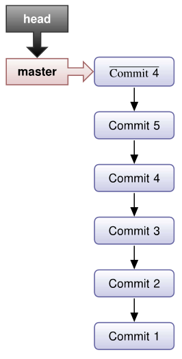

#### Reset

Restore ancient commit

Commit related files are not really deleated with reset. They're flagged and only deleted with `git gc`, if they're old enough.

##### `--hard`

- restores the commit reference (active branch)
- restores index
- restores data

##### regular (no flags)

- restores the commit reference (active branch)
- restores the index

##### `---soft`

- restores the commmit reference (active branch)

## Distributed git

### DVCS : Distributed version control system

### Remote push

Origin c'est un alias de la machine / facon de contacter la machine sur laquelle se trouve le clone, ca se change
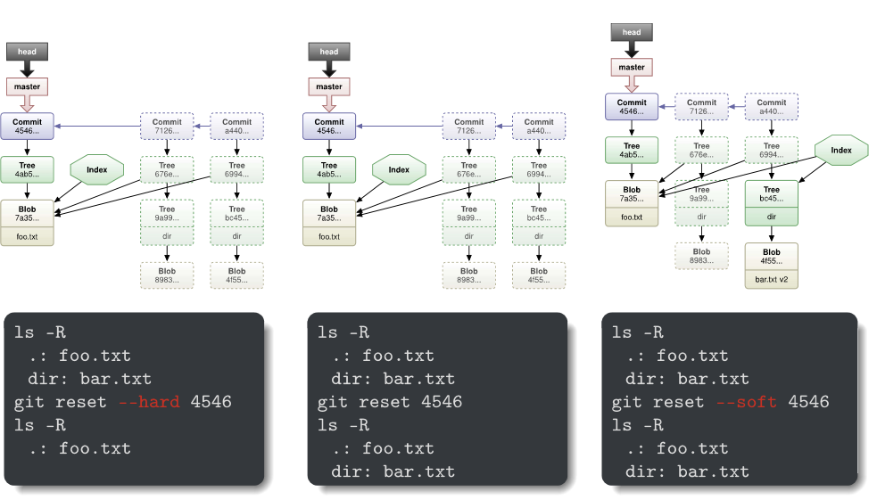

### Workflows

4 workflows possible

- __*Centralized Workflow*__ Centralized repo as in CVS in SVN.

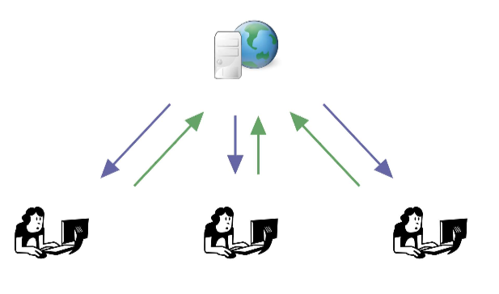

- __*Cooperative and Decentralized Workflow*__ One repo per developer, synchros all around, traditional Arch model

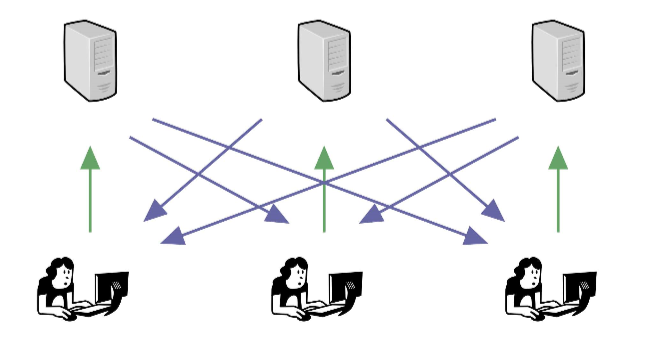

- __*Integration-Manager Workflow*__ One repo per developer and a manager who merges cleans and yells

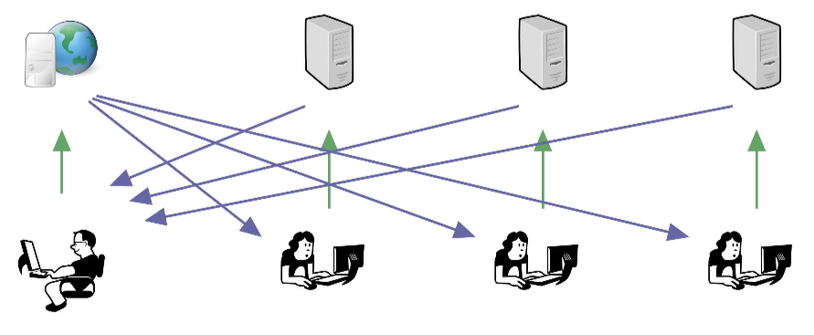

- __*Dictator and Lieutenants Workflow*__ Mail-based, linux kernel method

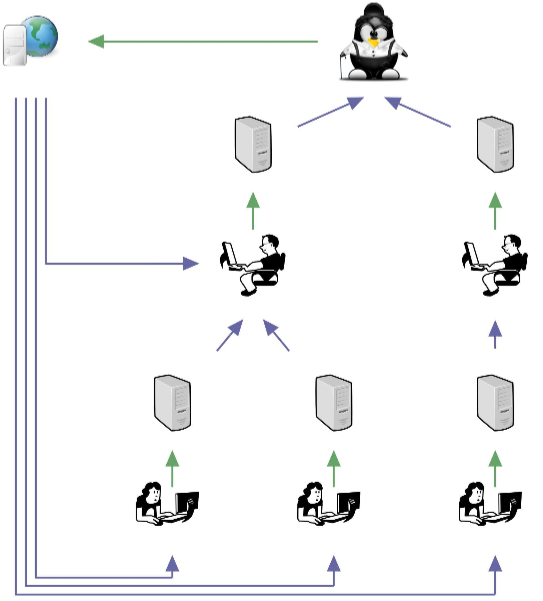

## Conclusions

- [+] The fastest one to apply patches
- [+] Easy to setup in server mode
- [+] Small powerful tools (Unix spirit)
- [+] Active development
- [-] Learning curve

## Extra ressources

- [Interactive Git cheat sheet](http://ndpsoftware.com/git-cheatsheet.html)
- 
- 
