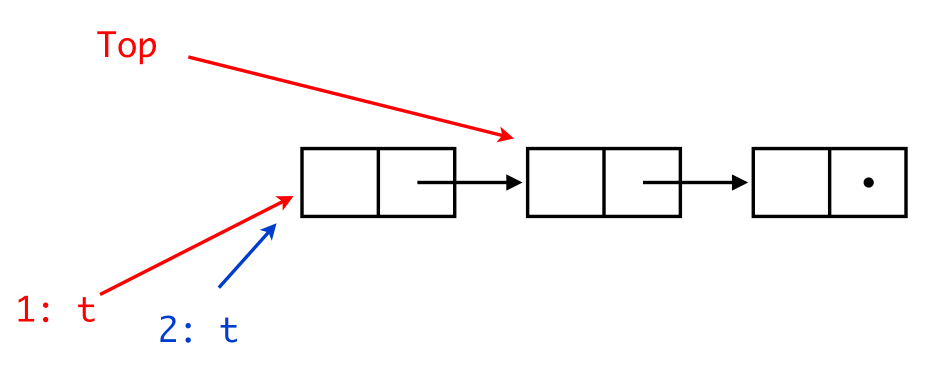

## L'accident du Therac-25
1985-87 Machine therapie a rayonnement 
- Tres pussant 
- Modulable par logiciel 
- Initialement, OK
- Au bout de 6 mois, surdoses x100, mortelles
- Ingenieurs n'arrivent pas a reproduire
- Uniquement lorsque l'operateur tape vite une erreur puis la corrige
- EN meme temps qu'un certain test 
- int overflow

## Ariane 501
Plusieurs calculateurs de vol communiquant sur un bus 
Un processus de verification de fond plante 
- calibre pour Ariate 4 : debordement 
- inutile 
- core dump sur le bus 
Interprete comme une commande 
- tuyeres braquees a fond
- auto-destruction 

$500m lost.


## Sequential Stack in a concurrent world

```c
pop ( ) {
    t = Top;
    if (t != nil)
        Top = t->tl;
    return t;
}

push (b) {
    b->tl = Top;
    Top = b;
    return true;
}
```

Imagine that two threads invoke `pop()` concurrently. They might pop the same entry!



## CAS - Compare and Swap
Solution for concurrency is sequential world.  
Hardware abstraction, in software, usually within `while(true)`

### What does it do
The `CAS(addr, expected, new)` tests if the `expected` is located at `addr`. If it is, it replaces it with `new` and returns `true`. Otherwise it returns `false` without any action.
### Code 
```c 
bool CAS(val_t *addr, val_t expected, val_t new_val) {
    atomic {
        if (*addr == exp) then {
            *addr = new; 
            return true; 
        }
        else return false;
    }
}
```
### Example
Considering the followint `pop()` code: 
```c 
pop() {
    while (true) {
        t = Top;
        if (t == nil) break;
        n = t->tl;
        if CAS(&Top,t,n) break;
    }
    return t;
}
```
and two processes `p1` and `p2`. 
Two concurrent `pop()` now work fine. 


`CAS` of th1 (red) fails.

## TAS - Test and Set / Get and Set 
Usually called TAS, should be called GAS (_Get And Set_).   
Hardware instruction but doesn't test (like CAS).
```java
class AtomicBoolean {
    private boolean b; 
    public synchronized boolean getAndSet() {
        boolean tmp = b; 
        b = true; 
        return tmp; 
    }
}

class AtomicReference<T> {
    private T ref; 
    public T getAndSet() { }
    public void set(T r) { } 
    public boolean synchronized compareAndSet(T expectedRef, T newRef) {
        if (ref == expectedRef) {
            ref = newRef; 
            return true; 
        } else 
            return false; 
    }
}
```

This mechanism is used essentially to implement low level locks.

### The ABA problem 
Free, allocate another thing at the same @, CAS passes through, invariant violated.

## LL/SC - Loal Link / Store Conditional 
Similar to CAS but very hard to implement
Supervise @s, if they change, tell user. 

`Load-Link(x)` supervises `x` address  
`Store-Conditional (x, y)`
- `x := y` return true, only if `x` was not modified since `Load-Link(x)`

#Invariants
## Logique de Hoare 
Logique qui permet de raisonner sur les programmes sequentielles.

_[p] C [q]_ 
- p : pre-condition 
- C : Calcul 
- q : post-contition

## Linearisability 

Point de linearisation -> fin d'execution

```
                       q.enq(x)
------------------|--------------|------------------------
                                 ^ here
```

## Java
`volatile` means that access to this var are gonna be serializable

## TM - Transactional Memory - Software TM - Hardware TM
Permet atomicite sur tout. 

Le Hard/Software checks allow atomicity for all.

## Peterson
The smallest possible synchro algo for two threads (verified with a model checked).  
The number of registers needed to implement it is exponential to the number of threads to synchronize.

# Architectures
## MIMD - Multiple Instruction Multiple Data

### Shared bus 
- Memory Contention 
- Communication Contention 
- Communication Latency

