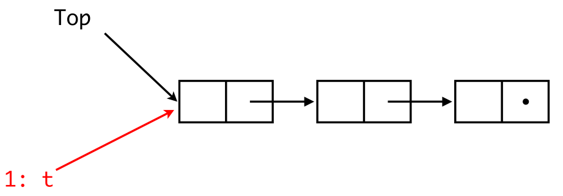
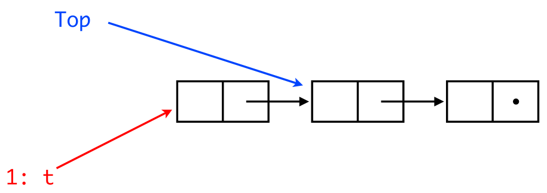
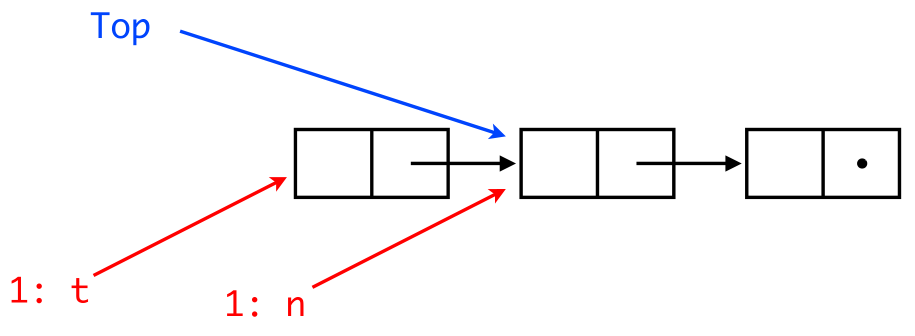
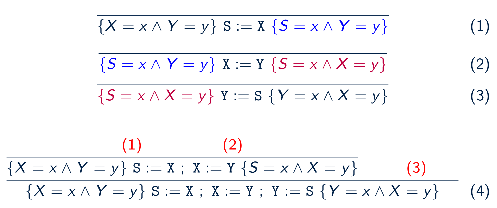

# Concurrency is hard.
## L'accident du Therac-25
1985-87 Machine therapie a rayonnement 
- Tres pussant 
- Modulable par logiciel 
- Initialement, OK
- Au bout de 6 mois, surdoses x100, mortelles
- Ingenieurs n'arrivent pas a reproduire
- Uniquement lorsque l'operateur tape vite une erreur puis la corrige
- EN meme temps qu'un certain test 
- int overflow

## Ariane 501
Plusieurs calculateurs de vol communiquant sur un bus 
Un processus de verification de fond plante 
- calibre pour Ariate 4 : debordement 
- inutile 
- core dump sur le bus 
Interprete comme une commande 
- tuyeres braquees a fond
- auto-destruction 

$500m lost.


## Sequential Stack in a concurrent world

```c
pop ( ) {
    t = Top;
    if (t != nil)
        Top = t->tl;
    return t;
}

push (b) {
    b->tl = Top;
    Top = b;
    return true;
}
```

Imagine that two threads invoke `pop()` concurrently. They might pop the same entry!


# Solutions?
## CAS - Compare and Swap
Solution for concurrency is sequential world.  
Hardware abstraction, in software, usually within `while(true)`

### What does it do
The `CAS(addr, expected, new)` tests if the `expected` is located at `addr`. If it is, it replaces it with `new` and returns `true`. Otherwise it returns `false` without any action.
### Code 
```c 
bool CAS(val_t *addr, val_t expected, val_t new_val) {
    atomic {
        if (*addr == exp) then {
            *addr = new; 
            return true; 
        }
        else return false;
    }
}
```
### Example
Considering the followint `pop()` code: 
```c 
pop() {
    while (true) {
        t = Top;
        if (t == nil) break;
        n = t->tl;
        if CAS(&Top,t,n) break;
    }
    return t;
}
```
and two processes `p1` and `p2`. 
Two concurrent `pop()` now work fine. 



`CAS` of th1 (red) fails.

## TAS - Test and Set / Get and Set 
Usually called TAS, should be called GAS (_Get And Set_).   
Hardware instruction but doesn't test (like CAS).
```java
class AtomicBoolean {
    private boolean b; 
    public synchronized boolean getAndSet() {
        boolean tmp = b; 
        b = true; 
        return tmp; 
    }
}

class AtomicReference<T> {
    private T ref; 
    public T getAndSet() { }
    public void set(T r) { } 
    public boolean synchronized compareAndSet(T expectedRef, T newRef) {
        if (ref == expectedRef) {
            ref = newRef; 
            return true; 
        } else 
            return false; 
    }
}
```

This mechanism is used essentially to implement low level locks.

## The ABA problem
The ABA problem occurs during synchronization, when a location is read twice, has the same value for both reads, and "value is the same" is used to indicate "nothing has changed". However, another thread can execute between the two reads and change the value, do other work, then change the value back, thus fooling the first thread into thinking "nothing has changed" even though the second thread did work that violates that assumption.
Free, allocate another thing at the same @, CAS passes through, invariant violated.

### Example
Process `p1` reads value `A` from shared memory,
- `p1` is preempted, allowing process `p2` to run,
- `p2` modifies the shared memory value A to value B and back to A before preemption,
- `p1` begins execution again, sees that the shared memory value has not changed and continues.
Although `p1` can continue executing, it is possible that the behavior will not be correct due to the "hidden" modification in shared memory.

### ELI5
John is waiting in his car at a red traffic light with his children. His children start fighting with each other while waiting, and he leans back to scold them. Once their fighting stops, John checks the light again and notices that it's still red. However, while he was focusing on his children, the light had changed to green, and then back again. John doesn't think the light ever changed, but the people waiting behind him are very mad and honking their horns now.

## Hazard pointers - Michael's algorithm
Michael adds to the previous algorithm a _global array_ `H` of _hazard pointers_: 
- thread `i` alone is allowed to write to element `H[i]` of the array; 
- any thread can read any entry of `H`.

The algorithm is then modified: 
- before popping a cell, a thread puts its address into its own element of `H`. This entry is cleared only if `CAS` succeeds or the stack is empty; 
- before pushing a cell, a thread checks to see whether it is pointed to from any element of `H`. If it is, push is delayed. Exponential backoff.

So, 
- A node can be added to the hazard array only if it is reachable through the stack; 
- a node that has been popped is not reachable through the stack; 
- a node that is unreachable in the stack and that is in the hazard array cannot be added to the stack; 
- while a node is reachable and in the hazard array, it has a constant tail.

### Michael's `pop()` and `push()`
```c
pop ( ) {
    while (true) {
        atomic { t = Top;
        H[tid] = t; };
        if (t == nil) break;
            n = t->tl;
        if CAS(&Top,t,n) break;
    }
    H[tid] = nil;
    return t;
}

push (b) {
    for (n = 0; n < no_threads, n++)
        if (H[n] == b) return false;
    while (true) {
        t = Top;
        b->tl = t;
        if CAS(&Top,t,b) break;
    }
    return true;
}

```
## LL/SC - Load Link / Store Conditional 
Similar to CAS but very hard to implement
Supervise addresses, if they change, notify. 

`Load-Link(x)` supervises `x` address  
`Store-Conditional (x, y)`
- `x := y` return true, only if `x` was not modified since `Load-Link(x)`

# Invariants
## Logique de Hoare
Logique qui permet de raisonner sur les programmes sequentielles.

## The Hoare triple
_[p] C [q]_ 
- p : pre-condition 
- C : Calcul 
- q : post-contition

## Keywords
- Sequence : `a ; b`
Two conditions: `{P} C1 {Q}` and `{Q} C2 {R}` sequence to `{P} C1; C2 {R}`  

- Skip (do nothing): `SKIP`
- Variable assignment: `X:=0`
- Conditional: `IF cond THEN a ELSE b FI`
- Loop: `WHILE cond DO c OD`

### Example
`{X=1} X:= X+1 {X=2}`

## Linearisability 

Point de linearisation -> fin d'execution

```
                       q.enq(x)
------------------|--------------|------------------------
                                 ^ here
```

## Java
`volatile` means that access to this var are gonna be serializable

## TM - Transactional Memory - Software TM - Hardware TM
Permet atomicite sur tout. 

Le Hard/Software checks allow atomicity for all.

## Peterson
The smallest possible synchro algo for two threads (verified with a model checked).  
The number of registers needed to implement it is exponential to the number of threads to synchronize.

# Architectures
## MIMD - Multiple Instruction Multiple Data

### Shared bus 
- Memory Contention 
- Communication Contention 
- Communication Latency

