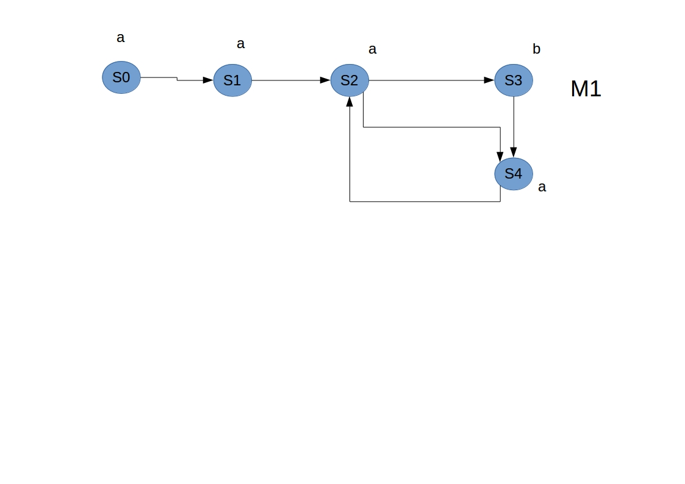

# Cours 7 - automates Büchi

Lors d'une réduction Y --> Z on note $\Sigma$ pour les symbols que Z accepte.

On note -->!$\phi U \phi '$ quand on doit faire attention à phi U phi'

pour passer d'une structure de Kriptke à un automate de buschi on transforme les etat en transitions.

pour une structure de Kriptke:

```mermaid
graph LR
0((q - p1))-->1((q' - p2))
1-->2((q'' - p3))
```

on créer un nouvel état:
```mermaid
graph LR
0((q,q'))-->|p2|1((q',q''))
```

Exemple (pas finit):

```mermaid
graph TB
0((q0',q0))-->|emptyset|1((q0,q1))
0-->|emptySet|2((q0, q2))
1-->|"{start, error}"|3((q1, q4))
3-->|"{start, close, error"|4((q4, q2))
3-->|"{start, close, error}"|5((q4, q1))
5-->|"{start, Error}"|3
4-->|"{close}"|6((q2, q1))
4-->|"{close}"|7((q2, q5))
6-->|emptySet|3
2-->|"{close}"|7((q2, q0))
4-->|"{close}"|8((q2, q5))
2-->|"{close}"|8
```
# Reduction

G(p->Fq) <=> $\bot R \{ ( \lnot p \lor \top U q) \}$

Il y a l'etat d'origine, puis le graph de réduction qui nous amène à un nouvel état (qu'il est possible de réduire)
On sait que la rédction est terminée quand on obtient en premier lieu une proposition atomique ou un Next (X).

pour calculer: next({...}) on regarde les etats finaux du graph de réduction, et l'on applique la fonction next({...}) sur ces états, exemple:

$next(\{\lnot p, X\phi\}) = \{\phi\}$ car on ne garde que les éléments qui sont après un next `X`

Les état acceptant sont ceux qui ne sont pas accesible via une transition avec un point d'exclamation sur leurs chemin dans le graph de réduction.

### Exo

phi = AG(a->AFb)
$= AG(\lnot a \lor AFb)$
$= \lnot EF(a \land \lnot AFb)$

Etapes:
- numéroter les états par leurs nombre de succésseurs.
- je regarde les prédécesseurs des états, si un état valide une formule alors ses successeurs le valide aussi.

ajout d'une condition d'équité:

$\Phi = A_fG(a->AFb)$
$A_fG(\lnot a \lor AF b)$
$\lnot E_fF(\lnot a \lor AFb)$
$\lnot E_fF(\lnot a \lor \lnot EG \lnot b)$

$fair: GF(Eb U (a \land \lnot b))$

$\phi : A_fGA_fFa$

Etiquetage:
- $a \land \lnot b$: S5
- $E b U (a \land \lnot b)$: S2, S0, S5

Pour calculer faire, on calcul les composnate fortement conexes.

on étiquetique par fair: S0, S1, S2, S5
S3 et S4 ne sont pas fair car ils ne satisfont pas la formule et du coup ils sont à part.

$A_fGA_fFa$
$\lnot E_fFE_fG\lnot a$

restriction de la structure de kiptke au état étiqueté par $\lnot a$:

```mermaid
graph LR
0((s1))-->1((s2))
0-->2((s3))
1-->2
2-->3((s4))
```
